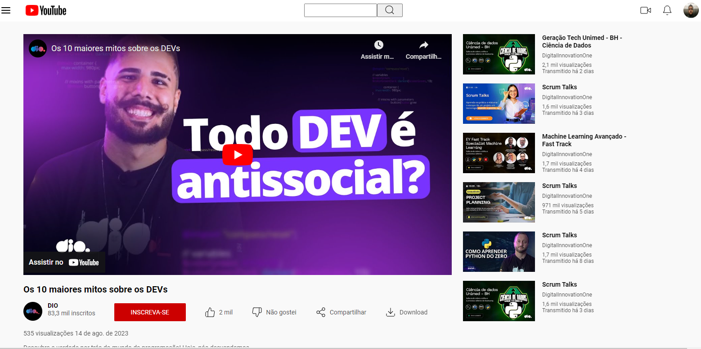

 👨‍💻 Desafio de Projeto CSS: Clonando a Página do Youtube com CSS

Projeto de HTML e CSS para clonar a página do YouTube usando Flexbox. Este projeto foi proposto pela especialista Michele Ambrosio da plataforma educacional DIO na Formação CSS Developer.

## 💻 Tecnologias usadas:
- HTML5
- CSS3

## 🖥 Preview:
)

Venha ver como ficou o projeto acessando [aqui](https://gbarros013.github.io/ClonandoSiteYoutube/).

## ⚙ Execução do projeto:
1. Clonar o Repositório: Basta utilizar o comando `git clone` para clonar este projeto e salvá-lo em sua máquina. Em seguida, execute o arquivo `index.html`.

2. GitHub Pages: Você também pode acessar o projeto [neste link](https://gbarros013.github.io/ClonandoSiteYoutube/), que abrirá o projeto no GitHub Pages, sem precisar baixar o repositório em sua máquina.

## 🤔 O que foi feito neste projeto:
- Criei um clone da página do YouTube usando os conceitos de Flexbox.
- Segui as orientações do arquivo do Figma disponibilizado no curso.

## 📌 Créditos
- Assets: Disponíveis no protótipo do Figma disponibilizado no curso.
- Vídeo do YouTube utilizado no projeto: [Vídeo do canal da DIO: Os 10 maiores mitos sobre os DEVs](https://www.youtube.com/watch?v=1sq1FmwXh9Q&t=3s)